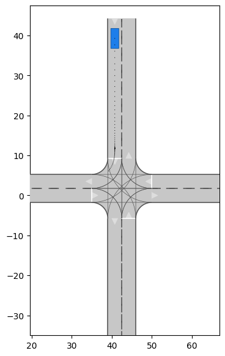

# Computing Interaction-aware Reachable Sets of Automated Vehicles by Monte Carlo Tree Search

The project is developed and verified based on the [CommonRoad](https://commonroad.in.tum.de/). The main problem is that the current calculation process of reachable sets is; first predict the trajectory of other vehicles, and then calculate the reachable sets. So the resulting reachable sets do not take into account the impact between vehicles. So this project uses MCTS to solve the vehicle interaction problem and obtain interaction-aware reachable sets.

### Reference
+ Tactical cooperative planning for autonomous highway driving using Monte-Carlo tree search
+ Computing the drivable area of autonomous road vehicles in dynamic road scenes
+ CommonRoad-Reach: A Toolbox for Reachability Analysis of Automated Vehicles

## Request Initialization Packages

We recommend using Ubuntu 18.04 and 20.04. And use Anaconda to create a conda environment to manage the required packages and libraries.

+ CommonRoad-IO

        pip install commonroad-io

+ CommonRoad Route Planner
 
        pip install commonroad-route-planner

+ CommonRoad Drivabilibty Check

    The intialization of this package refers to this [CommonRoad dc Domumentation](https://commonroad.in.tum.de/docs/commonroad-drivability-checker/sphinx/installation.html). We `git clone` the following branch: 

    https://gitlab.lrz.de/cps/commonroad-drivability-checker/-/tree/development 

    and use the following command to initial: 
    
        bash build.sh -j 6 --cgal -i

+ CommonRoad Reach
 
    The readme.md in this package provides a detailed activation tutorial. But it should be noted that:
    > You need to specify commonroad-drivability-checker package path that can be detected, that is, `DCRDC_DIR` instead of `CRDC_DIR`, otherwise the package will not be found.

            DCRDC_DIR="<your path>/commonroad-drivability-checker" pip install -v .
    >Secondly, use `cmake` to compile the file

            cmake .. -DPYTHON_VER="cpython-37" -DCRDC_DIR="<your path>/commonroad-drivability-checker"

     >Use the `make` to generate `pycrreach.xxx.so`, which needs to be copied and moved to the file directory `commonroad-reachable-set/commonroad-reach`. Finally, you can run the file to test whether the activation is successful,

## File Struct

+ [scenario](./scenario/) 

  Test scenarios are download from CommonRoad Benchmark.

+ [idm_model](./idm_model/)

  This folder contains two files, which implement the IDM follow-up model.

+ [monte_carlo_tree_serach](./monte_carlo_tree_search/)
  
  + [config.py](./monte_carlo_tree_search/config.py): Definition of gloable variables
  + [actions.py](./monte_carlo_tree_search/actions.py): Each Action is a value (acceleration)
  + [actions_range.py](./monte_carlo_tree_search/actions_range.py): Each Action is an range of acceleration
  + [basefunctions.py](./monte_carlo_tree_search/basefunctions.py): This file applies to action is an acceleration range. The file integrates various functional equations: 
  Collision detection, target area detection, reference path generation, idm agent definition, heuristic random selection, etc.
  + [basefunctions_O.py](./monte_carlo_tree_search/basefunctions_O.py): This file is similar to [basefunctions.py](./monte_carlo_tree_search/basefunctions.py), but applied to acrion is a value.
  + [mcts_node.py](./monte_carlo_tree_search/mcts_node.py): Basic componnets of MCTS. 
  + [mcts_idm_sim_reach.py](./monte_carlo_tree_search/mcts_idm_sim_reach.py): Reliazation of MCTS. An interval action is used and in simulation stage, the sequence decision will be made. The behaviour of surrounding vehicles is stimulated by the IDM model and the behaviour of ego vehicle will be controlled by heuristic random selection based on the action system.
  + [mcts_v.py](./monte_carlo_tree_search/mcts_v.py): Reliazation of MCTS. Action is a value and will be used only one sample tinme. In simulation stage, only the ego vehicle will be controlled by action sytem, the trajectories of other vehicles will be directly used to simulation.   
  + [mcts_v5.py](./monte_carlo_tree_search/idm_mcts_v5.py): Similar to [mcts_v.py](./monte_carlo_tree_search/mcts_v.py). Only one difference is that the action will be used for five sample times. 
  + [mcts_idm_sim_v5.py](./monte_carlo_tree_search/mcts_idm_sim_v5.py): Reliazation of MCTS. In simulation stage, the surrouding vehicles will be simulated by IDM, the action for ego vehicle is a value.
  + [visualization.py](./monte_carlo_tree_search/visualization.py): Visulization of the simulated result. 
  + Others: Test for different realization of MCTS. 

+ [mcst_example.py](./mcst_example.py)
  
   This file is to test the MCST with the action( a value). Simulation results include the postion and acceleration over time. And a gif file for ego vehilce shows that the ego vehicle moved based on the action list from MCTS.

+ [reach_example.py](./reach_example.py)
   
   This file is to test the MCST with the action( an range). Simulation results include action list and will be output to calulate the reachable sets. And a gif file for ego vehilce shows the interaction-aware reachable sets over time.

   #### Notice:

> Because we continuously update the maximum and minimum acceleration in the calculation of the reachable set, we need to update the zero state polygon at the same time when updating. And ensure that the reachable set is pruned at the end. So the source files in commonroad-reach need to be modified, and the modified files in the [commonroad-reach](./monte_carlo_tree_search/commonroad-reach) need to replace the original files.

+ [Others](./others/)
  + [Master Thesis](./others/MA_Xin_Zhang_V4.pdf)
  + [Prensentation Slides](./others/Pre_MA_XZ_V6.pdf)
  + [Simulation Result](./others/sim_result/)

## Uesage of Programm

### MCTS with a value action
Run [mcst_example.py](./mcst_example.py) with [mcts_idm_sim_v5.py](./monte_carlo_tree_search/mcts_idm_sim_v5.py) for the test scenario `DEU_IV21-1_1_T-1.xml`. 

The simularion result: 

	

Ego vehicle (id = 7) first decelerating for keeping a distance to leader vehilce (id = 6). Then ego vehicle accelerates to the desired velocity. Wenn the velocity of ego vehicle is higher than the desired velocity, the ego vehicle dont accelerating any more. The gif shows the result. 

	

### MCTS with an range action
Run [reach_example.py](./reach_example.py) with [mcts_idm_sim_reach.py](./monte_carlo_tree_search/mcts_idm_sim_reach.py) for the test scenario `ZAM_Intersection-1_2_T-1.xml`.

The first picture is the original reachable sets. The second picture shows the simulation results with the desired velocity of ego vehicle (15 m/s). Interaction-aware reachable sets shows that ego vehicle crosses the intersection first, 
and when we reduce the desired velocity to 6, we get the third picture and find that the ego vehicle waits for another vehicle to cross the intersection.

	
        
        

